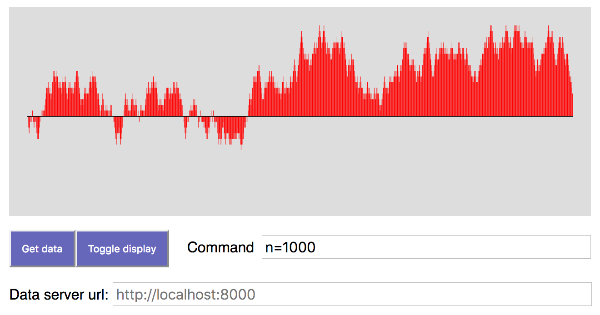
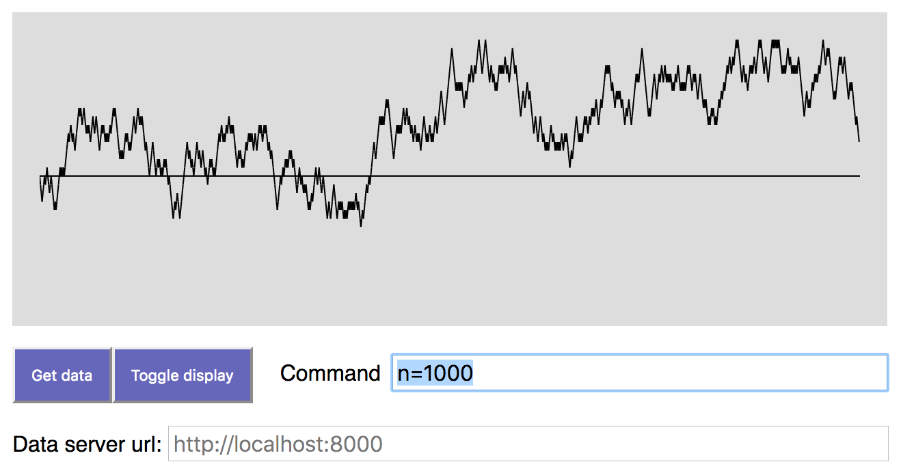

Option 1.

Option 2.

TimeSeries
==========

An app for visualizing time series data provided by
a web server.  

Directions:

1. Do `cd servers; chmod u+x dataServer.py` to make the data server
   executable.  Then run `./dataServer.py 8000`.  The data server
   is now running.

2. Return to the root of this folder and run `elm make src/TimeSeries.elm`. Then open `index.html`

3. Click on `Get Data`

When you did this, the request "/data=100" was sent
to the server at http://localhost:8000. The server generated a sequence
of 100 integers by doing a random walk: start with zero, then
repeatedly add random elements of {+1, -1}.

The server can be modified to generate other "time series."

The main idea is demonstrate the producer-consumer relation
between a generator of data and a visualizer for it.  You will
get images like the one above.

If you want serve data from a file, use `dataFileServer.py` instead,
and put the data in `data.txt`. The data there can be deposited by
another app if you want.  This way the data producer, data server,
and data client (the Elm visualizer) are independent of one another
and can be written in different languages.    
